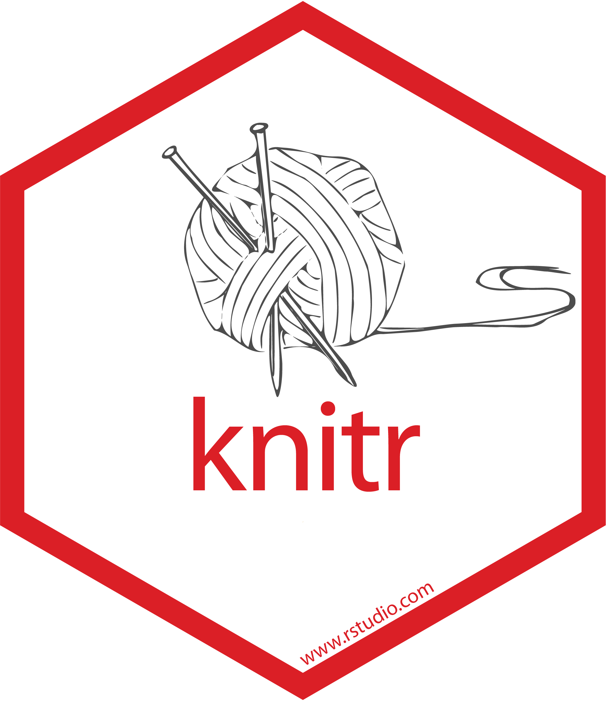
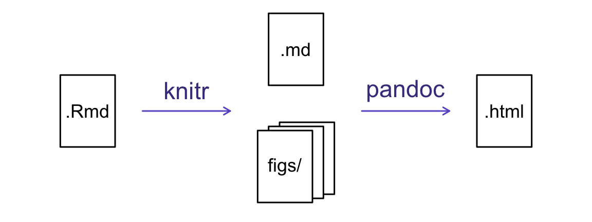

---
# Please do not edit this file directly; it is auto generated.
# Instead, please edit 02-Writing-Rmarkdown.md in _episodes_rmd/
title: Introduction to Rmarkdown
teaching: 0
exercises: 0
questions:
- "What is Markdown/R Markdown?"
- "How do I turn an R Markdown file into a report?"
objectives:
- "To understand how R Markdown files are written."
- "To integrate text descriptions with code and outputs."
- "To adjust parameters that customise a report's appearance"
keypoints:
- "Markdown is a way of writing text files in a *structured* way."
- "R Markdown allows integration of R code with Markdown."
- "Chunk options can be used to control formatting."
source: Rmd
---

## How does it all work?

{:class="fig-responsive" style="max-width:20%"}

The key R package is [knitr](http://yihui.name/knitr/). It allows you
to create a document that is a mixture of text in Markdown format and chunks of
code. When the document is processed by `knitr`, the chunks of code will
be executed, and graphs or other results inserted into an intermediate document.

This intermediate document (all in Markdown format) is then processed by the tool
[pandoc](http://pandoc.org/), which converts it into an html file, with any figures embedded.

## Creating an R Markdown file

Within RStudio, click File &rarr; New File &rarr; R Markdown and
you'll get a dialog box like this:

You can stick with the default output (HTML), but give it a title.

## R Markdown Metadata

The initial chunk of text (header) contains instructions for R to specify what kind of document will
be created, and the options chosen. If you provide no additional information, your header will look 
pretty slim:

~~~~
---
title: "Untitled"
output: html_document
---
~~~~

But you can use the header to give your document a title, author, date, and tell it that you're 
going to want to produce html output (in other words, a web page).

~~~~
---
title: "A Useful Title"
author: "Your Name"
date: "Today's date"
output: html_document
---
~~~~

> ## Setting up
>
> - Create a new RStudio Project for learning about R Markdown and initialise it with a Git repository
> - Create a new R Markdown file in the project.
> - Delete all the text *after* the header block (after the second `---`)
> - Make sure your document has an appropriate title, author, and date.
> - Save and commit your .Rmd file
> - Click the Knit button {:height="30px"}{:style="display: inline; margin:0px"} to create your document
>
{:.challenge}

Once you click the Knit button {:height="30px"}{:style="display: inline; margin:0px"},
your document will be converted from an R Markdown file into a Markdown file, and then into an html
file. A window will also open up to show you a preview of the output. 

Since we have not yet written any content for our document, it is obviously looking somewhat bare.

## Markdown formatting

Markdown is a system for writing web pages by marking up the text much
as you would in an email rather than writing html code. The marked-up
text gets _rendered_ to html, replacing the marks with the proper
html code.

#### Structuring content

You can make section headers of different sizes by initiating a line
with some number of `#` symbols:

~~~
# Title
## Main section
### Sub-section
#### Sub-sub section
~~~

When rendered, this text would be presented as headings that help break up content areas of your 
writing. For example, The "Markdown formatting" heading above is at the "Main section" level, while
the "Structuring content" heading is at the "Sub-sub section" level.

#### Formatting text

You can format text in a number of ways

You make things **bold** using two asterisks, like this: `**bold**`,
and you make things _italics_ by using underscores, like this:
`_italics_`. To format text as `code`, you wrap it in backticks, like this: `` `code` ``.

To make a bulleted list you write a list with asterisks or
hyphens, like this:

~~~
* bold with double-asterisks
* italics with underscores
* code-type font with backticks
~~~

or like this:

~~~
- bold with double-asterisks
- italics with underscores
- code-type font with backticks
~~~

Each will appear as:

- bold with double-asterisks
- italics with underscores
- code-type font with backticks

You can use whatever method you prefer, but *be consistant*. This maintains the
readability of your code.

You can make a numbered list by just using numbers. You can even use the
same number over and over if you want:

~~~~
1. bold with double-asterisks
2. italics with underscores
3. code-type font with backticks
~~~~

 or
 
~~~
1. bold with double-asterisks
1. italics with underscores
1. code-type font with backticks
~~~

Will appear as:

1. bold with double-asterisks
2. italics with underscores
3. code-type font with backticks

To aid the readability of your code in text form you should probably use the first options, but again
what is important is that you pick one method and stick with it for the entire document. 

#### More Markdown features

You can make a **hyperlink** like this:
`[Link to these notes](https://csiro-data-school.github.io/rmarkdown/)`.

Which appears as: [Link to these notes](https://csiro-data-school.github.io/rmarkdown/)

Including an **image** file is the same, adding an initial `!`:
``.
The link for this can either be to an image location on the web, or a file path on your computer. 

You can do **subscripts** (e.g., F2) with `F~2~` and **superscripts** (e.g.,
F2) with `F^2^`.

To include **footnotes**, use the following format:
~~~
Sentence that requires a footnote [^1].

[^1]: Footnote text
~~~

The footnote text can be written anywhere in the document and will be shifted to the end when it is
rendered into an html page.

> ## Writing text
> Add some Markdown formatted text to your document. Make sure to include some section headers, bold
> and italicised text, and at least one list.
>
> Save and Knit your document. Does it look how you were expecting?
{:.challenge}

## Integrating code

The real power of Markdown comes from
mixing markdown with chunks of code. This is R Markdown. When
processed, the R code will be executed; if they produce figures, the
figures will be inserted in the final document.

The main code chunks look like this:

<pre>
&#96;&#96;&#96;{r load_data}
gapminder <- read.csv("data/gapminder.csv")
&#96;&#96;&#96;
</pre>

That is, you place a chunk of R code between <code>&#96;&#96;&#96;{r chunk_name}</code>
and <code>&#96;&#96;&#96;</code>. You should give each chunk
a unique name, as they will help you to fix errors and, if any graphs are
produced, the file names are based on the name of the code chunk that
produced them.

> ## Writing code
> Make sure you have a copy of the gapminder data available. Then write a code chunk to:
> 
> - Load the tidyverse package
> - Read in the gapminder data 
> - Filter down to just the Australian data and print it to the screen
> - Show a plot of the Australian population over time
>
{:.challenge}

Integrating R code
	Code chunks - demo - Two step process, knitr runs code, formats as md. Then
	Read data, manipulate and print df, basic plot

	Break out into different sections, setup, manip, plot

	First one manually, second by highlighting and using insert again

	Chunk options. Which of "Run code, show code, show output" do we want for each block. Tick all that apply

	show table of options with all that apply (eval, echo, results) all default to TRUE
	
	(Ex.) Which options need to change for the three blocks? Demo first, do rest alone

	Move chunks to appropriate part of file, reknit.

	(Ex.) fig.width/height options, size in inches. DIY some changes

	Set global options in settings chunk `knitr::opts_chunk$set(fig.width=6, fig.height=6)`

	*Inline code*
	Describe why filtering down to one country by explaining "r nrow(gapminder)/12" countries is too many.
