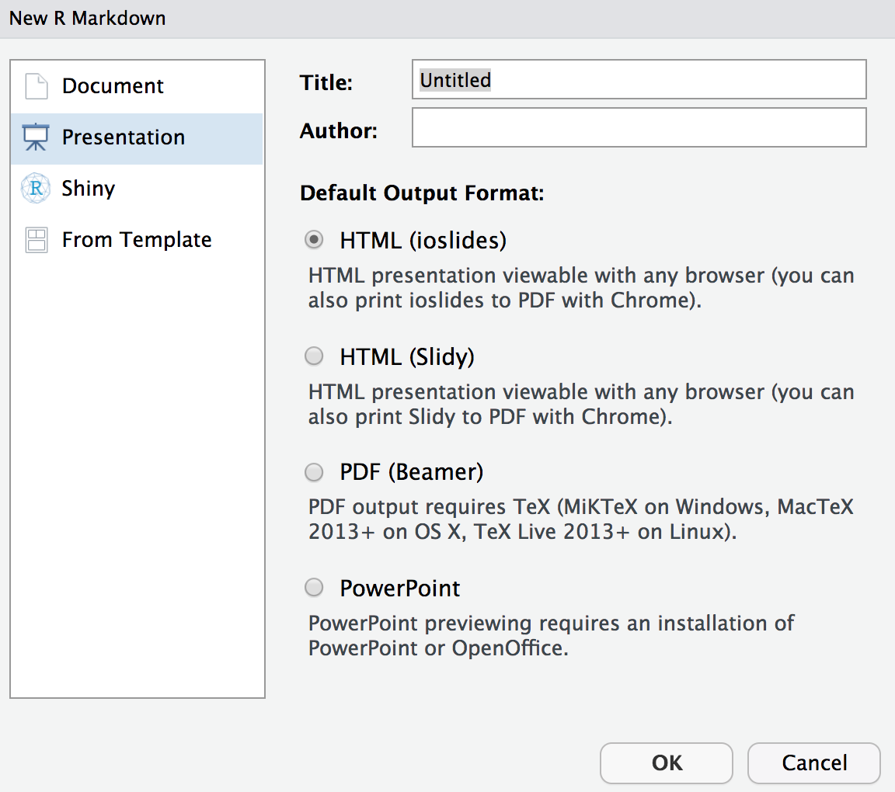

---
# Please do not edit this file directly; it is auto generated.
# Instead, please edit 04-Alternative-Outputs.md in _episodes_rmd/
title: Alternative outputs
teaching: 15
exercises: 40
questions:
- "What output formats can I create?"
objectives:
- "Produce several output formats from a single .Rmd document"
- "Adjust content to be appropriate for the output format"
keypoints:
- "Control the output format in the YAML with `output:` "
- "References can used in bibtex format"
source: Rmd
---

Up to now, we have not looked too closely at the output end of our process. We have been leaving it
up to the default settings to produce our final document as an html file. Let's look a bit closer
at how we can control precisely what final document we create.

## Output options

Each output format has a number of options that can be used to change the final appearance of your
document. For example, you can see the list of options for our html documents by checking the help
file: `?html_document`.

These options can be set by providing values in the header of your R Markdown file

~~~~
---
output:
  html_document:
    toc: TRUE
---
~~~~
{:.language-r}

Additional options can be provided on separate lines. The indentation of these lines matters, so make
sure you have everything aligned correctly.

> ## Changing options
> 
> After each of the following steps, knit your document and see what the effect of each option is.
>
> 1. Make sure you have headers at various levels (`#`, `##`, `###`, `####`) in your document. 
> Set the `toc` parameter to be `TRUE` as in the above example. What headers are recorded in the 
> table of contents?
>
> 2. Add an additional option setting `toc_float` to be `TRUE`. 
>
> 3. Set the `code_folding` option to `show` or `hide`. After rendering your document, use the other
> value to see the difference. How does `code_folding` interact with code chunks where you have set
> the `echo` parameter to be `TRUE` or `FALSE`?
>
> 4. Test out various combinations of the `theme` and `highlight` options. Can you find one you prefer?
{:.challenge}

## Using references

If you are looking at producing manuscsripts for publication, you will want to be able to include 
references in your final document. Use the `bibliography` option to point to your reference information
in a [supported format](https://rmarkdown.rstudio.com/authoring_bibliographies_and_citations.html). 
Some common formats include Bibtex (.bib) and Endnote (.enl) formats.

To cite these references in your document, put them within square brackets with an `@` followed by
the citation key from your bibliography:

~~~
Statement needing a citation [@<cite_ref>].
~~~
{:.language-r}

At the end of your document add a first level header for the references:

~~~
# References
~~~
{:.language-r}

and it will be filled in appropriately when you knit your document.

## Alternate outputs

If you are wanting to produce something other than an html document, you can change the output format
in the header block. There are a number of different inbuilt output formats you can create, and there
are also several packages you can install that provide access to additional formats.

### Word documents

To create a Word document from your R Markdown file use the `word_document` output format.

The output will use a default style for the formatting, but you can alter this styling by providing
a [reference word document](https://rmarkdown.rstudio.com/articles_docx.html) to copy the style from.

> ## Getting wordy
> 
> Change the output format of your document to a Word document (removing all the output options) and
> knit it. 
>
> Review the document you produced. Are there any major differences to your html output?
>
> Practice styling your document by:
> 1. Saving the document with a new name (eg. `Template.docx`)
> 2. Modifying the styles in the document using the Styles Pane (just modify, do not create new styles)
> 3. Save the new template
> 4. Knit your document again, setting the `reference_docx` option to your style template.
{:.challenge}

### PDF documents

To create a PDF document, use the `pdf_document` output format.

PDF documents are created using [Latex](https://www.latex-project.org), which you will need to install
on your machine separately. Trying to knit your PDF document without Latex installed will result in an 
error along with suggestions for how to install it on different operating systems.

### Presentations

It is possible to create presentations from your R Markdown document should you wish to make your talks
reproducible as well. There are several options for presentations that you can see by creating a new
R Markdown file ("File" > "New File" > "R Markdown...") and then selecting the "Presentation" tab.

{:class="fig-responsive" style="max-width:60%"}

These formats create either an HTML, PDF or Powerpoint presentation using your R Markdown file to define
the content of each slide. For example, to create an ioslides presentation, set the output format in your
R Markdown header to `ioslides_presentation`. 

For an alternative, you could install the `xaringan` package which produces HTML presentations built on the
[remark.js](https://remarkjs.com/) library. This output format is a little more flexible that the inbuilt
ioslides and Slidy formats which allow you more freedom in customising how your slides look and perform.

> ## Presentations
> 
> Since slides will usually require you to write your content in a different way to a report, make a
> copy of your R Markdown document. Then, pick a format and turn your document into a presentation.
>
> The presentation templates will give you some indication of how to use R Markdown to specify slide
> content. More details can often be found in the help page for each format. For example, `?ioslides_presentation`
> for help with an ioslides presentation.
{:.challenge}

### Other formats

There are a wide range of things that can be done with R Markdown. It is possible to produce [books](https://bookdown.org), [websites](https://bookdown.org/yihui/rmarkdown/rmarkdown-site.html) and [blogs](https://bookdown.org/yihui/blogdown/) from your R Markdown documents. 
