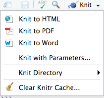
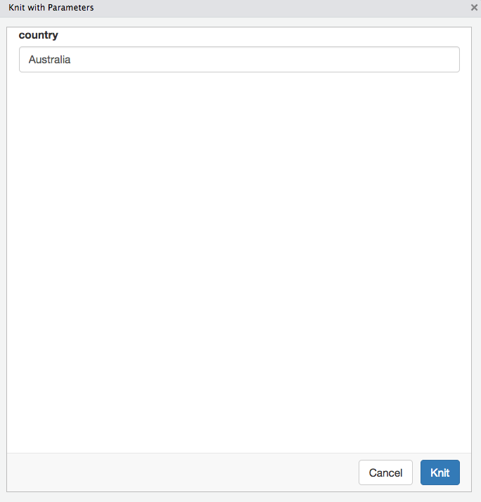

```{r chunk_options, include=FALSE}
source("../bin/chunk-options.R")
knitr_fig_path("03-")
```

We have now created an R Markdown document that can run our analysis and produce a report at the press
of a button. If we were wanting to produce the same report on a different subset of the data (or on
a different dataset altogether), we would need to go in and edit the document manually.

Instead, we can provide input parameters to the report that control how it is produced.
We then _set_ the parameters at the time we render the report, allowing us to customise the outputs
each time. 

## Adding parameters
To include parameters, we add them to the header block:

~~~~
---
params:
  param_name: param_value
---
~~~~

This will set up a parameter called `param_name`, with a default value of `param_value`. To access 
the current value of a parameter, you can refer to it in code with `params$param_name`.

> ## Parameterising your report
> Add a parameter `country` with the default value `Australia`. Then change your data manipulation 
> code chunk to refer to this value instead of being hard coded.
> 
> Save and Knit your document to check that it is still able to render correctly.
>
> To make it clearer for the reader what we are working on, add a title to our plot showing the 
> country we are working on. Also add a sentence in a text paragraph referencing it using an inline
> code block
{:.challenge}

## Changing parameters
Now that we have a report template set up, we can start to create multiple documents that use the same
analysis steps, but different inputs. To provide new values for the parameters that differ from the
default value you defined, use the "Knit with Parameters..." option that can be found in the dropdown
from the "Knit" button:



This will open up a new window that allows editing the parameters before rendering the document:



> ## Using parameters
> Knit your report after changing the parameter value to a different country. 
>
> What does the new rendered document look like? Where is it saved?
{:.challenge}

You will notice that our previously rendered document has been overwritten by our new report with 
different parameters. To take more control over how our document gets rendered, we can use
`rmarkdown::render()`.

`rmarkdown::render()` takes an input R markdown file and renders it, exactly as if we had used the 
"Knit" button. We can also control other parts of the rendering process with arguments, such as the
`output_file` name, or the list of `params` to use.

~~~~
rmarkdown::render(
  input = "Template_file.Rmd", 
  output_file = "Singapore.html", 
  params = list(country = "Singapore")
)
~~~~
{:.language-r}

Any parameters not specified in the `rmarkdown::render()` function will use the default values from
the R Markdown template.

> ## Challenge
> We are going to create two separate versions of our report. One version for drafting, which shows 
> all our code for review. The other version will be a final ''polished' document, which shows only
> the results of our code.
>
> - Add a new parameter to your document named `draft` with the default value `TRUE`.
> - Modify your document so that when `draft` is `TRUE`, all your code is shown in the output, and
> none of the code is shown when `draft` is `FALSE`. **Hint:** You can use parameters inside your
> global chunk settings
> - Use the "Knit with Parameters..." button with different parameters to check that your documents
> are being rendered as you expect.
> - Create an `Indonesia_draft.html` and an `Indonesia_final.html` report using `rmarkdown::render()`
>
> > ## Solution
> > Your new parameter block should look like:
> > ~~~~~
> > ---
> > params:
> >   country: Australia
> >   draft: TRUE
> > ---
> > ~~~~~
> > {:.language-r}
> > 
> > To parameterise how the code chunks get dealt with, you can set the global options using 
> > `params$draft` at the start of the document:
> >
> > <pre>
> > &#96;&#96;&#96;{r global_options}
> > knitr::opts_chunk$set(echo=params$draft, message=params$draft, warning=params$draft)
> > &#96;&#96;&#96;
> > </pre>
> > 
> > To create the final documents:
> > ~~~~
> > rmarkdown::render(
> >     "Template_file.Rmd", 
> >     output_file = "Indonesia_draft.html", 
> >     params = list(country = "Indonesia") # draft is TRUE by default
> > )
> >
> > rmarkdown::render(
> >     "Template_file.Rmd", 
> >     output_file = "Indonesia_final.html", 
> >     params = list(country = "Indonesia", draft = FALSE) 
> > )
> > ~~~~
> > {:.language-r}
>{:.solution}
{:.challenge}


<!-- Rmd docs to drive reproducibility -->
<!-- 	- Don't hard code directories - relative paths and self contained projects -->

<!-- 	- Run clean (does it work if you restart RStudio and knit immediately?) -->

<!-- 	- Track with git -> link code changes with output changes -->